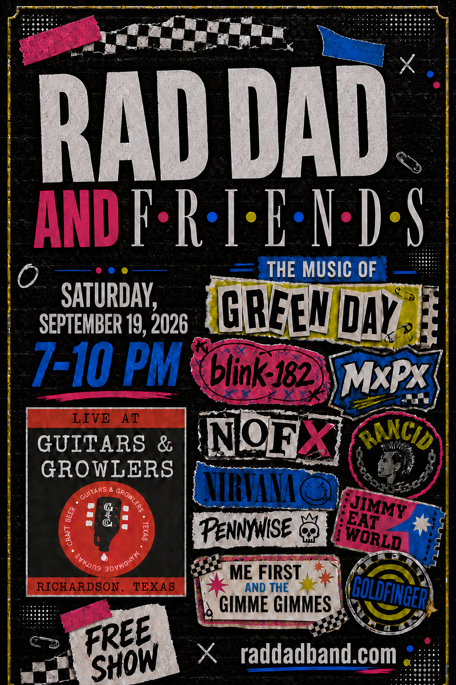

# Rad Dad + Friends Show Night

The shared show-night hub for **Rad Dad + Friends** at **Guitars & Growlers** on
**Saturday, September 19, 2026, from 7:00-10:00 PM**.

<p align="center">
  
</p>

## Open the site

### [OPEN THE PUBLIC SHOW PAGE](https://rad-dad-show-night.jeffstory007.chatgpt.site)

The public page is the link to send performers, friends, and guests. It includes
the master timeline, current official sets, production notes, and the public
suggestion board. Covers can show YouTube and lyrics when saved; originals hide
both. This is the live set surface, not the public band site, not the catalog,
and not the band OS. Show Night does not expand Vault. The public band site
stays at [raddadband.com](https://www.raddadband.com).

### [OPEN PRIVATE SHOW CONTROL](https://rad-dad-show-night.jeffstory007.chatgpt.site/show-control)

Show Control is the owner-only editor. Sign in with ChatGPT using
`jeffstory007@gmail.com` to add, edit, remove, and reorder songs. Saving a set
writes that show's official list without requiring a code change or GitHub
commit. A save updates the public page only when that show is already published.

## What the site does

- Manages multiple shows from one owner dashboard.
- Puts the public-link state, official set posture, and booking boundary in one
  phone-friendly status deck. It derives one next step: save unsaved work, start
  an empty list, publish a saved private show, or open band run mode. Leftover
  work on this verified show stays listed and tappable: leftover unsaved sets,
  leftover empty sets, and leftover share-link proof. Another night is never
  borrowed.
- Stops at a retry screen when the owner show payload cannot be verified. Add,
  Save, Publish, and Archive never appear from fallback editor state.
- Clones a complete show into a new private draft.
- Gives every published show its own shareable public link and lifecycle status.
- Keeps the default public show published so the main show link cannot be
  archived without a future replacement-default workflow.
- Keeps the complete 7:00-10:00 PM run of show in one place.
- Stores the official set lists in a shared production database.
- Lets the owner reorder songs by dragging or using Move Up and Move Down.
- Preserves intentional song-flow arrows and performer cues.
- Stores keys, tunings, endings, and private rehearsal notes per song.
- Shows YouTube and lyrics for covers only when the official set has a saved
  direct URL; originals hide both.
- Refreshes the public set lists automatically while the page is open.
- Keeps the last verified live set on the device when the database or network
  drops, without replacing it with an older fallback.
- Uses the reviewed September 19 baseline only for that exact event; another
  show fails closed instead of displaying the wrong songs.
- Keeps a cloned or future show on its own verified set. It cannot inherit
  another event's songs, set times, or flyer.
- Names one next action on first open from this show's verified list: start
  with the first official set, or suggest a song when this night is empty.
  Practice and leftover suggest stay after that step. An empty clone stays
  empty instead of borrowing another night.
- Keeps **Set lists** and **Suggest a song** in the phone header while moving
  the owner editor to the footer, so public visitors get the two useful public
  actions without another menu.
- Collects public song ideas without allowing suggestions to alter the set.
- Lets guests find existing ideas before sending, preserves uncertain drafts,
  and distinguishes a form response from an idea confirmed on the board.
- Assumes suggestions are covers unless the submitter marks one original.
- Protects all official-set changes behind owner authentication.
- Keeps the established black, electric-blue, lime, and hot-pink Rad Dad brand.
- Estimates set runtime from per-song durations.
- Runs Set Coach for timing, transitions, guest load, and readiness checks.

Draft and archived show slugs stay owner-only: anonymous page and API reads
return not found until the owner marks the show **Published** in Show Control.

Chord-sheet features are intentionally not included. Covers show YouTube and
lyrics only when a saved direct URL exists on the official set; songs marked
original hide both while retaining the band's own rehearsal notes. A local
covers table is not the set.

## Documentation

- [Show Control owner guide](docs/SHOW_CONTROL.md)
- [Canonical show plan and set lists](docs/SHOW_PLAN.md)
- [Technical, data, security, and deployment guide](docs/TECHNICAL_GUIDE.md)
- [Suggestion recovery product handoff](docs/SUGGESTION_RECOVERY_HANDOFF.md)

## Quick owner workflow

1. Open [Show Control](https://rad-dad-show-night.jeffstory007.chatgpt.site/show-control).
2. Sign in with the authorized ChatGPT account.
3. Choose **Jeff Story & Friends**, **Stalemate**, or **Rad Dad**.
4. Add a song, edit its details, or move it into position.
5. Paste the exact YouTube version when you have one.
6. Mark **Original / hide resources** when YouTube and lyrics do not apply.
7. Turn on **Flows to next** when the transition arrow is intentional.
8. Press **Save** for that set. If the show is published, its public list updates;
   if it is a draft or archived, the saved set stays private.

Unsaved changes remain private in the browser. Public suggestions also remain
separate until the owner deliberately adds one to a draft and saves it.
Saving a set writes that show's official list. It does not open a draft or
archived share link. Show Control blocks publish and archive actions while any
set has unsaved changes, and states whether an allowed lifecycle action opens
or closes the public share link before it runs.
The inline board has one application write path, `/api/suggestions`; its backup
link opens the connected Google Form directly rather than a second API route.

### Suggest a song without losing your place

Use **Find a song or artist** before adding an idea. This is one shared community
board for future shows, not a change request for the currently viewed set.
**Refresh board** checks the response Sheet; a failed check says unavailable
and keeps the last checked ideas instead of claiming the board is empty.

Sending once retains your draft while the app waits for board confirmation.
Only a later verified read matching the complete submission confirms arrival.
If delivery is uncertain, refresh first: the earlier request may still arrive.
Nothing automatically resends. A further attempt requires an explicit duplicate
warning acknowledgement, and the backup form is not offered during uncertain
delivery. Google Forms/Sheets cannot provide a transactional, exactly-once
guarantee here; a successful duplicate check cannot prevent simultaneous
submissions from different visitors. Draft recovery lasts in the current page,
not across a page close or reload.

## Phone tester path

Jeff can tap this on a phone without mixing Save and Publish:

1. Open the [public show page](https://rad-dad-show-night.jeffstory007.chatgpt.site).
   The header keeps **Set lists** and **Suggest a song**. The page says this
   public share link is live and names one next step: start with the first
   official set. It does not ask a visitor to choose fan vs band first.
2. Open [Show Control](https://rad-dad-show-night.jeffstory007.chatgpt.site/show-control)
   and sign in. The September 19 default public show stays **Published · public**.
   Archive stays blocked because the main show link would stop working. The
   status deck names the public link, official set plan, and that Travis owns
   booking, then presents one next step. Leftover work on this show sits under
   that step.
3. Choose **Clone show**, uncheck **Copy official songs and set times**, and
   create an empty draft. That night stays empty. The public share link stays
   closed until you publish. **Leftover on this show** lists leftover empty
   Stalemate and Rad Dad plus leftover **See closed public link**. Tap a leftover
   empty set to start it here. It still does not inherit September 19 songs.
4. Save a set on the draft if you want. Saving writes this private show. It
   does not open the public link. The editor says **Private draft — not public**.
   Leftover unsaved other sets stay listed as leftover saves.
5. Tap leftover **See closed public link**. The public page says no published
   show was found and does not open September 19 songs.
6. Publish the empty draft. The share link opens on an empty night. It still
   does not inherit another show's set.
7. Archive that non-default show. The share link closes again.

Do not archive the default public show. Travis still books. This path does not
invent outreach or send public posts.

## Show-night data status

The status above the official sets distinguishes three states:

- **Verified live list** — the set came from the show database.
- **Last verified live list** — live reads are interrupted, so the app keeps
  the exact set previously verified and saved on this device.
- **Confirmed code baseline** — the default September 19 event is using its
  reviewed repository baseline because no verified device copy is available.

Fallback data is scoped to that one event. A cloned or future show never
borrows the September set when its own database rows cannot be verified; the
page reports that the show is temporarily unavailable instead. Live refresh,
offline snapshots, and cached API responses also refuse another show's payload,
so a clone cannot inherit another event's set after first paint.

The hero names one next step for this show from this show's verified list.
First open starts with the first official set. Leftover suggest and practice
stay after that step. A show with no verified songs stays empty instead of
inheriting another night. The public homepage stays on the default published
show and will not silently open the latest clone. Public reads omit owner
rehearsal notes. Those rehearsal notes stay in Show Control. Owner edits stay
in Show Control. On narrow screens, the header prioritizes **Set lists** and
**Suggest a song**; the owner-only Show Control action remains available in the
footer instead of competing with public navigation.

## Local development

Requirements: a current Node.js installation and npm.

```bash
npm ci
npm run dev
```

Create a local `.env` when testing authenticated or automatic YouTube features:

```bash
ADMIN_EMAIL=jeffstory007@gmail.com
YOUTUBE_API_KEY=
```

`ADMIN_EMAIL` is required for owner writes. `YOUTUBE_API_KEY` is optional. When
the key is absent, Show Control creates a YouTube search link and lets the owner
paste the preferred video URL.

Set Coach always provides a local smart review. Add `OPENAI_API_KEY` as a Sites
secret to enable the optional AI review, and optionally set `OPENAI_MODEL`
(default: `gpt-5.4-mini`).

Build the production application with:

```bash
npm run build
```

Verify the source without live provider or owner writes:

```bash
npm test
npm run lint
npm run typecheck:suggestions
npx playwright install chromium
npm run test:browser
npm run leftover:hosted
```

Browser tests render the actual suggestion and owner components with intercepted
fixtures. They block unmocked APIs and external services; they do not verify live
sign-in, Google Forms/Sheets, or Sites deployment. The focused typecheck covers
the changed suggestion surfaces; the full standalone check still has existing
Worker declarations and show-store errors described in the handoff.

## Hosting

The production application is hosted with OpenAI Sites rather than GitHub
Pages. GitHub is the public source repository; Sites supplies the server routes,
owner sign-in, environment variables, and D1 database required by the live
editor.

Pushing code to `main` keeps the repository current but does not, by itself,
replace the Sites production deployment. Changes made inside Show Control are
database updates and appear publicly without a GitHub deployment.

## Surfaces

- Live set surface: this Show Night app. Official order, keys, and handoffs
  live in Sites D1 and are edited in Show Control.
- Catalog: Vault. Show Night does not expand Vault and does not dump catalog
  titles onto the public page.
- Band OS: StoryBoard. Show Night does not become a second homepage or band OS.
- Public band site: [raddadband.com](https://www.raddadband.com). That site is
  the public Rad Dad homepage, not the night-of set.

## Source of truth

- Live set data: Sites D1 database
- Show records and cloned timelines: Sites D1 database
- Initial confirmed set data: `lib/show-data.ts`
- Database schema: `db/schema.ts`
- Database migration: `drizzle/0000_show_control.sql`
- Public suggestions: connected Google Form and response Sheet
- Canonical human-readable plan: [docs/SHOW_PLAN.md](docs/SHOW_PLAN.md)
- Public band site: [raddadband.com](https://www.raddadband.com)

The expected finish is around 10:00 PM. It is a planned wrap time, not a venue
curfew.
